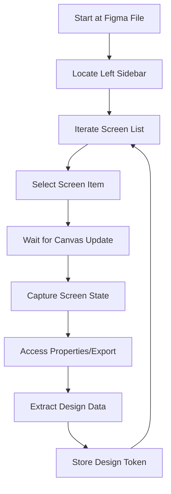

# Phase 1: Setup & Discovery

## Phase Overview

**Duration**: Week 1
**Status**: 🟡 Planning
**Goal**: Establish automation infrastructure and understand Figma interface patterns for systematic design extraction.

## Objectives

1. **Configure Automation Environment**: Set up Playwright MCP and supporting tools
2. **Document Figma Interface**: Map UI elements, selectors, and interaction patterns
3. **Create Utility Functions**: Build reusable automation and analysis utilities
4. **Establish Workflows**: Define repeatable processes for screen interaction

## Success Criteria

- ✅ Playwright MCP successfully navigates Figma interface
- ✅ Comprehensive UI element documentation created
- ✅ Screen capture and analysis utilities functional
- ✅ Authentication and access workflows established

## Detailed Implementation Plan

### 1.1 Environment Setup

#### 1.1.1 Playwright MCP Configuration
```bash
# Verify Playwright MCP availability
mcp__playwright__browser_install

# Test basic browser functionality
mcp__playwright__browser_navigate --url="https://www.figma.com"
mcp__playwright__browser_snapshot
```

**Tasks**:
- [ ] Install and configure Playwright MCP
- [ ] Test browser navigation capabilities
- [ ] Configure screenshot capture settings
- [ ] Set up persistent session management

**Deliverables**:
- Functional Playwright MCP setup
- Browser configuration documentation
- Session management procedures

#### 1.1.2 Authentication Setup
```typescript
// Example authentication workflow
async function setupFigmaAuth() {
  // Navigate to login
  await browser_navigate("https://www.figma.com/login");

  // Handle login process (implementation depends on auth method)
  // - OAuth integration
  // - Token-based authentication
  // - Session persistence

  // Verify successful login
  await verifyLoggedInState();
}
```

**Tasks**:
- [ ] Determine Figma access method (share link, direct login, API)
- [ ] Implement authentication workflow
- [ ] Test session persistence
- [ ] Document access requirements

**Deliverables**:
- Authentication workflow documentation
- Access token management procedures
- Session validation utilities

### 1.2 Figma Interface Analysis

#### 1.2.1 UI Element Mapping
```javascript
// Expected Figma interface structure
const figmaInterface = {
  sidebar: {
    screensList: "div[data-testid=\"layers-panel\"]",
    screenItem: "div.layer-item",
    canvas: "div.canvas-container",
    properties: "div.properties-panel"
  },
  toolbar: {
    export: "button[aria-label*=\"Export\"]",
    code: "button[aria-label*=\"Code\"]",
    inspect: "button[aria-label*=\"Inspect\"]"
  },
  canvas: {
    frames: "div.frame-item",
    components: "div.component-item"
  }
};
```

**Tasks**:
- [ ] Navigate to target Figma file
- [ ] Document left sidebar structure
- [ ] Map screen/frame navigation elements
- [ ] Identify CSS/code extraction access points
- [ ] Create element selector library

**Deliverables**:
- Comprehensive UI element selector map
- Navigation workflow documentation
- Element interaction patterns

#### 1.2.2 Interaction Pattern Discovery


**Tasks**:
- [ ] Document screen selection flow
- [ ] Map CSS extraction menu interactions
- [ ] Identify loading state indicators
- [ ] Create interaction sequence library

**Deliverables**:
- Interaction flow diagrams
- State management procedures
- Error handling strategies

### 1.3 Utility Development

#### 1.3.1 Screen Capture Utilities
```typescript
interface ScreenCapture {
  screenshot: string; // base64 image data
  metadata: {
    screenName: string;
    dimensions: { width: number; height: number };
    timestamp: string;
    elements: Element[];
  };
}

interface Element {
  type: string; // button, input, card, etc.
  selector: string;
  bounds: { x: number; y: number; width: number; height: number };
  styles: StyleProperties;
}
```

**Tasks**:
- [ ] Create screenshot capture function
- [ ] Implement element detection and bounding
- [ ] Build metadata extraction utilities
- [ ] Develop file organization system

**Deliverables**:
- Screen capture utility library
- Element detection algorithms
- Metadata extraction functions

#### 1.3.2 Design Analysis Utilities
```typescript
interface DesignToken {
  colors: ColorPalette[];
  typography: Typography[];
  spacing: Spacing[];
  components: ComponentDefinition[];
}

interface ColorPalette {
  name: string;
  value: string; // hex/rgb
  usage: string[];
}

interface Typography {
  fontFamily: string;
  fontSize: number;
  fontWeight: number;
  lineHeight: number;
  usage: string[];
}
```

**Tasks**:
- [ ] Create color palette extraction
- [ ] Implement typography analysis
- [ ] Build spacing measurement utilities
- [ ] Develop component recognition algorithms

**Deliverables**:
- Design token extraction library
- Pattern recognition utilities
- Analysis validation functions

### 1.4 Workflow Establishment

#### 1.4.1 Navigation Workflow
```typescript
async function navigateScreens(): Promise<ScreenInfo[]> {
  const screens: ScreenInfo[] = [];

  // 1. Get all screen items from sidebar
  const screenItems = await getScreenItems();

  // 2. Iterate through each screen
  for (const item of screenItems) {
    // 3. Select screen and wait for load
    await selectScreen(item);

    // 4. Capture screen state
    const screenInfo = await captureScreenState(item);

    // 5. Extract design tokens
    const designTokens = await extractDesignTokens(screenInfo);

    screens.push({ ...screenInfo, designTokens });
  }

  return screens;
}
```

**Tasks**:
- [ ] Implement screen iteration logic
- [ ] Create state waiting mechanisms
- [ ] Build error recovery procedures
- [ ] Develop progress tracking

**Deliverables**:
- Complete navigation workflow
- State management utilities
- Progress tracking system

#### 1.4.2 Quality Assurance
```typescript
async function validateExtractionquality(
  screenInfo: ScreenInfo
): Promise<ValidationReport> {
  return {
    screenshotQuality: await verifyScreenshotClarity(screenInfo),
    elementCoverage: await verifyElementDetection(screenInfo),
    dataCompleteness: await verifyDesignTokens(screenInfo.designTokens),
    consistency: await verifyPatternConsistency(screenInfo)
  };
}
```

**Tasks**:
- [ ] Create extraction quality metrics
- [ ] Implement validation procedures
- [ ] Build error detection algorithms
- [ ] Develop quality reporting

**Deliverables**:
- Quality assurance framework
- Validation utilities
- Error reporting system

## Technical Requirements

### Prerequisites
- Node.js environment
- Playwright MCP access
- Figma file access (link or credentials)
- Image processing capabilities

### Dependencies
```json
{
  "dependencies": {
    "playwright": "^1.40.0",
    "@playwright/test": "^1.40.0",
    "sharp": "^0.33.0", // image processing
    "color-thief": "^2.3.0", // color extraction
    "jsdom": "^23.0.0" // DOM parsing
  }
}
```

## Risk Mitigation

### Technical Risks
- **Figma Interface Changes**: Build flexible selectors with fallbacks
- **Authentication Issues**: Implement multiple access strategies
- **Performance Issues**: Optimize capture and analysis processes

### Quality Risks
- **Incomplete Data**: Implement comprehensive validation
- **Pattern Recognition**: Manual verification of automated analysis
- **Data Consistency**: Establish strict formatting standards

## Deliverables Summary

### Documentation
- Figma interface element map
- Authentication and access procedures
- Navigation and interaction workflows
- Quality assurance guidelines

### Code/Utilities
- Playwright automation scripts
- Screen capture utilities
- Design token extraction functions
- Validation and quality assurance tools

### Configuration
- Browser and MCP settings
- Authentication token management
- File organization structure
- Error handling procedures

## Next Phase Preparation

### Handoff to Phase 2
- Complete screen navigation workflows
- Functional design token extraction
- Established quality standards
- Comprehensive documentation

### Success Metrics
- Navigate 10+ different screen types successfully
- Extract design tokens with 90%+ accuracy
- Complete automation of repetitive tasks
- Establish scalable and maintainable processes

---

*This phase establishes the foundation for automated Figma design extraction. Success in this phase enables efficient and accurate design token generation in Phase 2.*