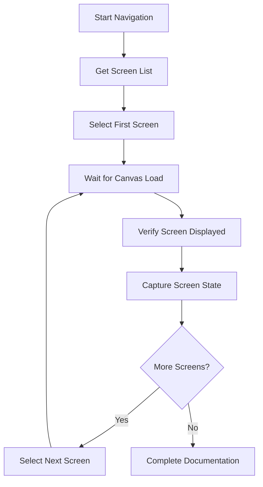

# Phase 2: Screen Documentation

## Phase Overview

**Duration**: Week 1-2
**Status**: 🟡 Planning
**Goal**: Navigate all Figma screens systematically and create comprehensive design token documentation with visual metadata.

## Objectives

1. **Automate Screen Navigation**: Systematically traverse all screens in Figma left sidebar
2. **Capture Visual Assets**: Create high-quality screenshots and visual metadata
3. **Extract Design Tokens**: Generate structured JSON/MD files with comprehensive design data
4. **Organize Design Library**: Create searchable and maintainable design token database

## Success Criteria

- ✅ Navigate 100% of screens in target Figma file
- ✅ Generate structured design token files for each screen
- ✅ Create comprehensive visual documentation archive
- ✅ Establish design token organization system

## Detailed Implementation Plan

### 2.1 Screen Navigation Automation

#### 2.1.1 Sidebar Screen Discovery
```typescript
interface ScreenItem {
  id: string;
  name: string;
  type: 'frame' | 'component' | 'group';
  path: string[];
  isVisible: boolean;
  parent?: string;
}

async function discoverAllScreens(): Promise<ScreenItem[]> {
  const screens: ScreenItem[] = [];

  // Navigate to layers panel
  await browser_click({
    element: "Layers panel tab",
    ref: "[data-testid=\"layers-panel-tab\"]"
  });

  // Expand all collapsed folders
  await expandAllFolders();

  // Extract all screen items
  const rawScreens = await extractScreenItemsFromSidebar();

  // Process and organize screen hierarchy
  return organizeScreenHierarchy(rawScreens);
}
```

**Tasks**:
- [ ] Implement sidebar navigation automation
- [ ] Create screen item detection algorithm
- [ ] Build hierarchical structure parser
- [ ] Develop screen filtering and categorization

**Deliverables**:
- Complete screen inventory database
- Screen hierarchy mapping
- Navigation automation scripts

#### 2.1.2 Screen Selection Workflow


**Tasks**:
- [ ] Implement robust screen selection logic
- [ ] Create canvas load detection mechanisms
- [ ] Build screen state verification utilities
- [ ] Develop error recovery procedures

**Deliverables**:
- Screen selection automation library
- Canvas state detection utilities
- Navigation error handling procedures

### 2.2 Visual Asset Capture

#### 2.2.1 Screenshot Generation
```typescript
interface ScreenScreenshot {
  screenId: string;
  screenName: string;
  timestamp: string;
  dimensions: {
    width: number;
    height: number;
    devicePixelRatio: number;
  };
  formats: {
    fullPage: string; // base64 full page screenshot
    canvas: string;   // canvas area only
    thumbnail: string; // compressed thumbnail
  };
}

async function captureScreenAssets(screen: ScreenItem): Promise<ScreenScreenshot> {
  // Ensure screen is fully loaded and visible
  await ensureScreenReady(screen);

  // Capture full page screenshot
  const fullPage = await mcp__playwright__browser_take_screenshot({
    type: "png",
    filename: `screenshots/${screen.id}_full.png`,
    element: "Full page",
    ref: "body",
    fullPage: true
  });

  // Capture canvas area only
  const canvas = await mcp__playwright__browser_take_screenshot({
    type: "png",
    filename: `screenshots/${screen.id}_canvas.png`,
    element: "Canvas area",
    ref: "[data-testid=\"canvas-container\"]",
    fullPage: false
  });

  return {
    screenId: screen.id,
    screenName: screen.name,
    timestamp: new Date().toISOString(),
    dimensions: await getCanvasDimensions(),
    formats: {
      fullPage: fullPage,
      canvas: canvas,
      thumbnail: await generateThumbnail(canvas)
    }
  };
}
```

**Tasks**:
- [ ] Create multi-format screenshot capture system
- [ ] Implement high-quality image optimization
- [ ] Build thumbnail generation utilities
- [ ] Develop image metadata extraction

**Deliverables**:
- Screenshot capture automation
- Image optimization pipeline
- Visual asset organization system

#### 2.2.2 Element Detection & Bounding
```typescript
interface DetectedElement {
  id: string;
  type: string;
  selector: string;
  bounds: {
    x: number;
    y: number;
    width: number;
    height: number;
  };
  zIndex: number;
  isVisible: boolean;
  parentId?: string;
}

async function detectScreenElements(): Promise<DetectedElement[]> {
  // Use Figma's inspect panel or DOM analysis
  const elements = await browser_evaluate({
    function: () => {
      // Custom JavaScript to extract all visible elements
      const allElements = document.querySelectorAll('[data-figma-element-id]');
      return Array.from(allElements).map(el => ({
        id: el.getAttribute('data-figma-element-id'),
        type: el.getAttribute('data-figma-type'),
        bounds: el.getBoundingClientRect(),
        zIndex: window.getComputedStyle(el).zIndex,
        isVisible: el.offsetParent !== null
      }));
    }
  });

  return elements.filter(el => el.isVisible);
}
```

**Tasks**:
- [ ] Implement element detection algorithms
- [ ] Create bounding box extraction utilities
- [ ] Build element hierarchy mapping
- [ ] Develop visibility analysis functions

**Deliverables**:
- Element detection library
- Bounding box extraction utilities
- Element relationship mapping

### 2.3 Design Token Extraction

#### 2.3.1 Color Palette Analysis
```typescript
interface ColorToken {
  id: string;
  name: string;
  value: string; // hex, rgb, hsl
  usage: {
    elements: string[];
    count: number;
    contexts: string[];
  };
  semantic: {
    primary?: boolean;
    secondary?: boolean;
    accent?: boolean;
    neutral?: boolean;
    status?: 'success' | 'warning' | 'error' | 'info';
  };
}

async function extractColorPalette(screenshot: string): Promise<ColorToken[]> {
  // Use image analysis to extract dominant colors
  const dominantColors = await analyzeImageColors(screenshot);

  // Map colors to Figma's color styles if available
  const figmaColors = await getFigmaColorStyles();

  // Combine and categorize colors
  return categorizeColors(dominantColors, figmaColors);
}
```

**Tasks**:
- [ ] Create color extraction from screenshots
- [ ] Implement Figma color style detection
- [ ] Build color categorization algorithms
- [ ] Develop semantic color mapping

**Deliverables**:
- Color extraction utilities
- Color palette database
- Semantic color mapping system

#### 2.3.2 Typography Analysis
```typescript
interface TypographyToken {
  id: string;
  name: string;
  fontFamily: string;
  fontSize: number;
  fontWeight: number;
  lineHeight: number;
  letterSpacing?: number;
  textTransform?: string;
  usage: {
    elements: string[];
    hierarchy: 'h1' | 'h2' | 'h3' | 'h4' | 'h5' | 'h6' | 'body' | 'caption';
    context: string[];
  };
}

async function extractTypography(elements: DetectedElement[]): Promise<TypographyToken[]> {
  const textElements = elements.filter(el =>
    el.type === 'text' || el.type === 'label' || el.type === 'heading'
  );

  const typographyStyles = await Promise.all(
    textElements.map(async (element) => {
      const styles = await browser_evaluate({
        function: (selector) => {
          const el = document.querySelector(selector);
          const computed = window.getComputedStyle(el);
          return {
            fontFamily: computed.fontFamily,
            fontSize: parseFloat(computed.fontSize),
            fontWeight: parseInt(computed.fontWeight),
            lineHeight: parseFloat(computed.lineHeight),
            letterSpacing: parseFloat(computed.letterSpacing),
            textTransform: computed.textTransform
          };
        },
        element: `element with selector ${element.selector}`,
        ref: element.selector
      });

      return {
        id: element.id,
        ...styles,
        usage: {
          elements: [element.id],
          hierarchy: inferTextHierarchy(styles),
          context: inferTextContext(element)
        }
      };
    })
  );

  return groupSimilarTypography(typographyStyles);
}
```

**Tasks**:
- [ ] Implement text element detection
- [ ] Create computed style extraction
- [ ] Build typography pattern grouping
- [ ] Develop hierarchy inference algorithms

**Deliverables**:
- Typography extraction library
- Style pattern analysis
- Typography system documentation

#### 2.3.3 Spacing & Layout Analysis
```typescript
interface SpacingToken {
  id: string;
  name: string;
  value: number; // in pixels
  type: 'margin' | 'padding' | 'gap' | 'position';
  direction: 'top' | 'right' | 'bottom' | 'left' | 'all';
  usage: {
    elements: string[];
    frequency: number;
    contexts: string[];
  };
  scale: {
    base: number;
    multiplier: number;
  };
}

async function extractSpacingPatterns(elements: DetectedElement[]): Promise<SpacingToken[]> {
  // Analyze spatial relationships between elements
  const spacingAnalysis = await analyzeElementSpacing(elements);

  // Identify common spacing values
  const commonSpacing = findCommonSpacingValues(spacingAnalysis);

  // Map to design system scale
  return mapToSpacingScale(commonSpacing);
}
```

**Tasks**:
- [ ] Create spatial relationship analysis
- [ ] Implement spacing pattern detection
- [ ] Build spacing scale mapping
- [ ] Develop layout grid identification

**Deliverables**:
- Spacing analysis utilities
- Layout pattern detection
- Design system scale mapping

### 2.4 Design Token Organization

#### 2.4.1 JSON Token Structure
```json
{
  "screen": {
    "id": "screen-001",
    "name": "Dashboard Overview",
    "path": ["Dashboard", "Overview"],
    "metadata": {
      "dimensions": { "width": 1440, "height": 1024 },
      "device": "desktop",
      "timestamp": "2024-01-15T10:30:00Z",
      "screenshot": "screenshots/screen-001_canvas.png"
    },
    "tokens": {
      "colors": [
        {
          "id": "primary-blue",
          "name": "Primary Blue",
          "value": "#3B82F6",
          "usage": { "elements": ["btn-primary"], "count": 5 },
          "semantic": { "primary": true }
        }
      ],
      "typography": [
        {
          "id": "heading-large",
          "name": "Heading Large",
          "fontFamily": "Inter",
          "fontSize": 32,
          "fontWeight": 700,
          "lineHeight": 1.2,
          "usage": { "elements": ["dashboard-title"], "hierarchy": "h1" }
        }
      ],
      "spacing": [
        {
          "id": "spacing-large",
          "name": "Large Spacing",
          "value": 24,
          "type": "padding",
          "scale": { "base": 8, "multiplier": 3 }
        }
      ],
      "components": [
        {
          "id": "data-table",
          "name": "Data Table",
          "type": "table",
          "elements": ["table-header", "table-row", "table-cell"],
          "variants": ["default", "striped", "bordered"]
        }
      ]
    },
    "interactions": {
      "clickable": ["btn-primary", "nav-item", "menu-item"],
      "hoverable": ["card", "button", "link"],
      "focusable": ["input", "textarea", "select"]
    }
  }
}
```

**Tasks**:
- [ ] Create standardized JSON schema
- [ ] Implement token generation automation
- [ ] Build token validation utilities
- [ ] Develop cross-screen token comparison

**Deliverables**:
- JSON token schema specification
- Token generation automation
- Token validation framework

#### 2.4.2 Markdown Documentation Generation
```markdown
# Screen: Dashboard Overview

## Overview
- **Screen ID**: screen-001
- **Path**: Dashboard → Overview
- **Device**: Desktop (1440x1024)
- **Last Updated**: 2024-01-15T10:30:00Z

## Visual Assets


## Design Tokens

### Colors
| Token | Value | Usage | Semantic |
|-------|-------|-------|----------|
| `primary-blue` | #3B82F6 | Buttons, links | Primary |

### Typography
| Token | Font | Size | Weight | Usage |
|-------|------|------|--------|-------|
| `heading-large` | Inter | 32px | 700 | Page titles |

### Components
- **Data Table**: Main content display
- **Navigation Bar**: Screen navigation
- **Action Buttons**: Primary interactions

## Implementation Notes
- Uses 8px grid system
- Consistent with design system v2.0
- Responsive breakpoints: tablet, mobile
```

**Tasks**:
- [ ] Create markdown template system
- [ ] Implement automated documentation generation
- [ ] Build cross-referencing utilities
- [ ] Develop searchable documentation structure

**Deliverables**:
- Markdown documentation templates
- Automated documentation generation
- Cross-referenced design library

## File Organization Structure

```
docs/results/
├── design_tokens/
│   ├── screen-001.json
│   ├── screen-002.json
│   └── ...
├── screenshots/
│   ├── screen-001_full.png
│   ├── screen-001_canvas.png
│   ├── screen-001_thumb.png
│   └── ...
├── documentation/
│   ├── screen-001.md
│   ├── screen-002.md
│   └── ...
└── analysis/
    ├── color-palette-summary.json
    ├── typography-system.json
    ├── spacing-scale.json
    └── component-inventory.json
```

## Quality Assurance

### 2.5.1 Extraction Validation
```typescript
interface ValidationReport {
  screenId: string;
  screenshotQuality: {
    resolution: boolean;
    clarity: boolean;
    completeness: boolean;
  };
  tokenExtraction: {
    colors: number;
    typography: number;
    spacing: number;
    components: number;
  };
  dataIntegrity: {
    jsonValid: boolean;
    markdownGenerated: boolean;
    crossReferences: boolean;
  };
}

async function validateScreenDocumentation(screenId: string): Promise<ValidationReport> {
  return {
    screenId,
    screenshotQuality: await validateScreenshots(screenId),
    tokenExtraction: await countExtractedTokens(screenId),
    dataIntegrity: await validateFileIntegrity(screenId)
  };
}
```

**Tasks**:
- [ ] Create validation metrics and procedures
- [ ] Implement automated quality checks
- [ ] Build error detection and reporting
- [ ] Develop manual review guidelines

## Risk Mitigation

### Technical Risks
- **Large File Numbers**: Implement efficient batch processing
- **Inconsistent Screens**: Create flexible extraction patterns
- **Performance Issues**: Optimize image capture and analysis

### Quality Risks
- **Missing Data**: Implement comprehensive validation
- **Inconsistent Tokens**: Establish strict formatting standards
- **Incomplete Documentation**: Create thorough review processes

## Deliverables Summary

### Primary Outputs
- Complete design token library (JSON format)
- Comprehensive screen documentation (Markdown)
- Screenshot archive with metadata
- Component inventory and analysis

### Secondary Outputs
- Color palette summary
- Typography system documentation
- Spacing scale specification
- Cross-screen pattern analysis

### Tools & Utilities
- Screen navigation automation
- Design token extraction library
- Documentation generation system
- Quality validation framework

## Next Phase Preparation

### Handoff to Phase 3
- Complete design token database
- Comprehensive screen documentation
- Established quality standards
- Automated extraction workflows

### Success Metrics
- Document 100% of target screens
- Extract design tokens with 95%+ accuracy
- Generate consistent, maintainable documentation
- Create scalable organization system

---

*This phase creates the comprehensive design documentation foundation that enables systematic component analysis and extraction in Phase 3.*