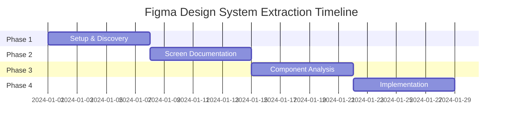

# Figma Design System Extraction Project Plan

## Project Overview

**Objective**: Automate the extraction of design tokens and components from Figma screens to create a comprehensive design system and component library.

**Approach**: Use Playwright MCP to navigate Figma interfaces, capture screenshots, extract design metadata, and analyze patterns across screens to build reusable components.

## Timeline & Phases



## Phase Summary

### Phase 1: Setup & Discovery (Week 1)
**Goal**: Establish automation infrastructure and understand Figma interface patterns.

**Key Activities**:
- Configure Playwright MCP for Figma access
- Document UI selectors and interaction patterns
- Create screen capture utilities
- Test authentication workflows

**Deliverables**:
- Functional Playwright automation setup
- Figma interface documentation
- Screen capture utility library

### Phase 2: Screen Documentation (Week 1-2)
**Goal**: Navigate all Figma screens and create structured design tokens.

**Key Activities**:
- Automate left sidebar navigation
- Capture screenshots of each screen
- Extract design metadata (colors, typography, spacing)
- Generate JSON/MD design token files

**Deliverables**:
- Complete screen inventory
- Structured design token library
- Screenshot archive with metadata

### Phase 3: Component Analysis (Week 2-3)
**Goal**: Identify patterns and extract reusable components from design tokens.

**Key Activities**:
- Analyze design tokens for common patterns
- Group similar elements across screens
- Create component hierarchy and relationships
- Document component variants and states

**Deliverables**:
- Component inventory catalog
- Pattern analysis report
- Component relationship mapping

### Phase 4: Implementation (Week 3-4)
**Goal**: Convert design tokens into implementable React/shadcn components.

**Key Activities**:
- Generate React component implementations
- Create component documentation
- Validate against original designs
- Establish component library maintenance

**Deliverables**:
- Complete component library
- Implementation documentation
- Validation reports

## Technical Stack

### Automation Tools
- **Playwright MCP**: Browser automation for Figma interaction
- **Image Analysis**: Visual pattern recognition
- **JSON Schema**: Structured data format

### Output Formats
- **Design Tokens**: JSON format with comprehensive metadata
- **Documentation**: Markdown with structured sections
- **Components**: React with TypeScript interfaces
- **Styles**: Tailwind CSS classes

## Success Criteria

### Automation Success
- ✅ Navigate all Figma screens without manual intervention
- ✅ Extract comprehensive design metadata
- ✅ Generate structured design token files

### Design System Quality
- ✅ Identify 80%+ of reusable components
- ✅ Create consistent component API patterns
- ✅ Maintain visual fidelity to original designs

### Implementation Readiness
- ✅ Components integrate with existing tech stack
- ✅ Comprehensive documentation for developers
- ✅ Validation processes ensure quality

## Risk Mitigation

### Technical Risks
- **Figma Interface Changes**: Build flexible selectors and fallback strategies
- **Authentication Issues**: Implement secure token management
- **Complex Components**: Break down into manageable sub-components

### Quality Risks
- **Pattern Recognition**: Manual validation of automated analysis
- **Component Consistency**: Establish clear design principles
- **Implementation Gaps**: Rigorous testing against designs

## Project Structure

```
docs/
├── project_plan.md                    # This file
├── phase_1_setup_discovery.md         # Phase 1 detailed plan
├── phase_2_screen_documentation.md    # Phase 2 detailed plan
├── phase_3_component_analysis.md      # Phase 3 detailed plan
├── phase_4_implementation.md          # Phase 4 detailed plan
└── results/
    ├── design_tokens/                 # Generated design token files
    ├── screenshots/                   # Screen captures with metadata
    ├── components/                    # Extracted component definitions
    └── validation/                    # Quality assurance reports
```

## Dependencies

### Prerequisites
- Access to Figma design files
- Playwright MCP configuration
- Development environment setup

### External Dependencies
- Figma API access (if needed)
- Image processing capabilities
- JSON schema validation tools

## Next Steps

1. **Review Phase Plans**: Examine detailed phase documents for specific implementation steps
2. **Environment Setup**: Configure tools and access requirements
3. **Begin Phase 1**: Start with setup and discovery activities
4. **Progress Tracking**: Use phase documents to track completion status

---

*This project plan serves as the coordination document for all phases. Refer to individual phase documents for detailed implementation guidance.*