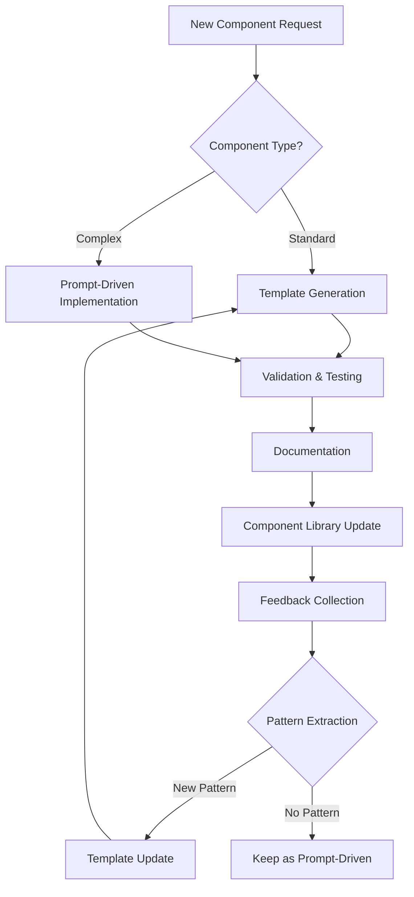

# Stage 3 Final Implementation Plan: Hybrid Component Generation Strategy

## 🎯 **Strategic Vision: Controlled Automation Approach**

Adopt a hybrid approach that starts with prompt-driven component generation for precision learning, then transitions to template-based automation for scale. This strategy minimizes risk while maximizing learning and efficiency.

## 🏗️ **Three-Phase Implementation Strategy**

### **Phase 1: Foundation via Prompt-Driven Generation (Week 1)**
**Goal**: Learn exact patterns through precise implementation of core components

**Approach**: Use Option 3 (Prompt-Driven) for first 4 critical components
- Start with highest-impact components
- Validate design token integration
- Refine requirements through real implementation
- Extract proven patterns for template foundation

### **Phase 2: Template System Development (Week 2)**
**Goal**: Build automated generation system based on learned patterns

**Approach**: Transition to Option 1 (Template-Based) using learnings from Phase 1
- Develop Jinja2 template library from implemented components
- Create design token integration pipeline
- Build component generation workflow
- Generate remaining components automatically

### **Phase 3: Mature Mixed System (Week 3+)**
**Goal**: Optimize for long-term maintenance and scalability

**Approach**: Maintain hybrid system for ongoing needs
- 80% of components via automated templates
- 20% complex components via prompt-driven approach
- Continuous improvement loop
- Documentation and knowledge transfer

## 📋 **Phase 1: Prompt-Driven Foundation Implementation**

### **Component Implementation Priority Order:**

#### **Priority 1: Core Interaction Components**
1. **Button Component** - Universal interaction element
   - Variants: primary, secondary, outline, ghost
   - Sizes: sm, md, lg, xl
   - States: loading, disabled, hover
   - Platform: Web (Tailwind) + Mobile (NativeWind)

2. **Input Component** - Essential data entry
   - Types: text, email, password, number
   - States: default, error, success, loading
   - Features: validation, helper text, accessibility
   - Integration: react-hook-form compatibility

3. **Card Component** - Fundamental display container
   - Variants: default, elevated, outlined, bordered
   - Sections: header, content, footer
   - Responsive: mobile-first design
   - Interactive: hover effects, transitions

4. **Alert Component** - Critical feedback system
   - Types: success, warning, error, info
   - Actions: dismissible, action buttons
   - Accessibility: ARIA live regions
   - Animation: slide-in, fade effects

### **Implementation Process for Each Component:**

#### **Step 1: Prompt Preparation**
```markdown
COMPONENT IMPLEMENTATION REQUEST - [Component Name]

## Component Details
- Name: [Component Name]
- Type: [Form/Display/Navigation/Feedback]
- Category: [Specific category]
- Platform: Web & Mobile
- Priority: [1-4]

## Requirements
### Core Functionality
- [Specific functional requirements from component_interfaces.json]
- [User interaction patterns needed]
- [State management requirements]

### Design Integration
- Use these Stage 2 design tokens: [specific tokens]
- Apply this visual specification: [detailed requirements]
- Integrate with existing: [shadcn components]

### Technical Implementation
- File: src/components/[category]/[component].tsx
- Base on: [shadcn/ui component reference]
- Follow: [unified-ui patterns]
- Interface: [exact interface from Stage 2]

### Constraints
- ONLY implement this component exactly
- Use existing shadcn components as foundation
- Apply unified-ui StandardHookReturn pattern
- Must work on both web and mobile platforms

### Validation Checklist
- [ ] Component renders without errors
- [ ] All props from Stage 2 interface work
- [ ] Design tokens applied correctly
- [ ] Web (Tailwind) compatibility
- [ ] Mobile (NativeWind) compatibility
- [ ] Accessibility compliance
- [ ] Integration with existing components
```

#### **Step 2: Design Token Integration**
For each component, extract relevant tokens from Stage 2 outputs:

```typescript
// Example: Button Component Design Tokens
const buttonDesignTokens = {
  colors: {
    primary: {
      base: stage2_outputs.web_config.colorPalette.primary['500'],
      hover: stage2_outputs.web_config.colorPalette.primary['600'],
      text: '#ffffff'
    },
    // ... other color variants
  },
  typography: {
    fontFamily: stage2_outputs.web_config.typography.fontFamily.Poppins,
    fontWeight: stage2_outputs.web_config.typography.fontWeight.medium,
    // ... other typography tokens
  },
  spacing: {
    // Padding from Stage 2 spacing scale
    sm: `${stage2_outputs.web_config.spacing['2']}px`,
    md: `${stage2_outputs.web_config.spacing['3']}px`,
    lg: `${stage2_outputs.web_config.spacing['4']}px`,
    // ... other spacing values
  },
  borderRadius: {
    md: `${stage2_outputs.web_config.borderRadius.md}px`,
    lg: `${stage2_outputs.web_config.borderRadius.lg}px`,
    // ... other radius values
  }
}
```

#### **Step 3: Implementation Validation**
After each component implementation:
1. **Visual Validation**: Component matches design specifications
2. **Functional Testing**: All props and interactions work correctly
3. **Design Token Compliance**: Colors, typography, spacing applied correctly
4. **Cross-Platform Testing**: Works on both web and mobile
5. **Accessibility Testing**: WCAG 2.1 AA compliance
6. **Integration Testing**: Works with existing components

### **Phase 1 Deliverables:**
- ✅ 4 production-ready components with full TypeScript interfaces
- ✅ Design token integration patterns documented
- ✅ Cross-platform compatibility established
- ✅ Component validation checklist refined
- ✅ Implementation patterns extracted for template development

## 📋 **Phase 2: Template System Development**

### **Template Architecture Design:**

#### **Template Hierarchy:**
```
templates/
├── base/
│   ├── component.j2                 # Base component template
│   ├── form-component.j2           # Base form component template
│   ├── display-component.j2        # Base display component template
│   └── interactive-component.j2    # Base interactive component template
├── components/
│   ├── forms/
│   │   ├── input.j2                # Input component template
│   │   ├── select.j2               # Select component template
│   │   ├── checkbox.j2             # Checkbox component template
│   │   └── textarea.j2             # Textarea component template
│   ├── display/
│   │   ├── card.j2                 # Card component template
│   │   ├── badge.j2                # Badge component template
│   │   ├── avatar.j2               # Avatar component template
│   │   └── skeleton.j2             # Skeleton component template
│   ├── navigation/
│   │   ├── button.j2               # Button component template
│   │   ├── tabs.j2                 # Tabs component template
│   │   └── pagination.j2           # Pagination component template
│   ├── feedback/
│   │   ├── alert.j2                # Alert component template
│   │   ├── modal.j2                # Modal component template
│   │   └── toast.j2                # Toast component template
│   └── data/
│       ├── table.j2                # Table component template
│       └── list.j2                 # List component template
├── hooks/
│   ├── use-component-state.j2      # Component state hook template
│   ├── use-form-state.j2           # Form state hook template
│   └── use-async-data.j2           # Async data hook template
├── types/
│   ├── component-props.j2          # Component props interface template
│   └── hook-types.j2               # Hook return type template
└── partials/
    ├── imports.j2                  # Import statements template
    ├── variants.j2                 # CVA variant definitions template
    ├── accessibility.j2            # Accessibility attributes template
    └── error-handling.j2           # Error handling patterns template
```

#### **Template Engine Implementation:**
```python
import jinja2
from typing import Dict, Any
from pathlib import Path

class ComponentGenerator:
    def __init__(self, stage2_outputs_path: str, templates_dir: str, output_dir: str):
        self.stage2_outputs = self._load_stage2_outputs(stage2_outputs_path)
        self.templates_dir = Path(templates_dir)
        self.output_dir = Path(output_dir)
        self.jinja_env = self._setup_jinja_environment()

    def _setup_jinja_environment(self) -> jinja2.Environment:
        """Configure Jinja2 environment with custom filters"""
        env = jinja2.Environment(
            loader=jinja2.FileSystemLoader(self.templates_dir),
            trim_blocks=True,
            lstrip_blocks=True
        )

        # Custom filters for design token processing
        env.filters['token_value'] = self._get_token_value
        env.filters['css_class'] = self._token_to_css_class
        env.filters['tsx_type'] = self._token_to_tsx_type
        env.filters['platform_class'] = self._platform_specific_class

        return env

    def generate_component(self, component_name: str, platform: str = 'web') -> str:
        """Generate a component using templates"""
        # 1. Load component configuration from Stage 2
        component_config = self._get_component_config(component_name)

        # 2. Select appropriate template
        template_path = self._select_template(component_config)
        template = self.jinja_env.get_template(template_path)

        # 3. Prepare template context with design tokens
        context = self._prepare_context(component_config, platform)

        # 4. Generate component code
        generated_code = template.render(**context)

        # 5. Format and validate
        formatted_code = self._format_code(generated_code)
        self._validate_component(formatted_code)

        return formatted_code

    def _prepare_context(self, config: Dict, platform: str) -> Dict[str, Any]:
        """Prepare template context with design tokens"""
        stage2_tokens = self.stage2_outputs['web_config.json' if platform == 'web' else 'mobile_config.json']

        return {
            'component_name': self._to_pascal_case(config['name']),
            'component_config': config,
            'design_tokens': {
                'colors': stage2_tokens.get('colorPalette', {}),
                'typography': stage2_tokens.get('typography', {}),
                'spacing': stage2_tokens.get('spacing', {}),
                'borderRadius': stage2_tokens.get('borderRadius', {}),
                'effects': stage2_tokens.get('effects', {})
            },
            'platform': platform,
            'uses_cva': config.get('variants', False),
            'uses_hooks': config.get('stateManagement', False),
            'accessibility': config.get('accessibility', True)
        }
```

#### **Base Component Template (component.j2):**
```jinja2
"""{{ component_name }} Component - Generated by Stage 3 Component Generator"""
"use client"

import * as React from "react"

import { {{ design_tokens.typography.fontFamily.keys() | join(', ') } } from "@/lib/fonts"


import { cva } from "class-variance-authority"


import { useComponentState } from "@iamplus/hooks/use-component-state"



{{ component_imports }}


{{ component_interface }}



{{ variant_definitions }}

const {{ component_name }}Variants = cva(
  "{{ base_classes }}",
  {
    variants: {
      {{ variants | indent(6) }}
    },
    defaultVariants: {
      {{ default_variants | indent(6) }}
    }
  }
)



{{ accessibility_implementations }}

export function {{ component_name }}({
  
  {{ prop.name }}{{ loop.last ? '' : ',' }}
  
}: {{ component_name }}Props) {
  
  const { data, loading, error, actions } = useComponentState({
    initialState: {{ initial_state }},
    validation: {{ validation_config }}
  })
  

  
  const classes = {{ component_name }}Variants({
    
    {{ variant.name }}: {{ variant.value }},
    
    className
  })
  
  const classes = "{{ base_classes }} " + (className || "")
  

  
  return (
    <div className={classes} {{ accessibility_attributes }} style={style}>
      
      {loading_state}
      

      
      {error_state}
      

      {{ component_body }}
    </div>
  )
  
  return (
    <View style={[baseStyles, styles]} {{ accessibility_attributes }}>
      
      {loading_state_mobile}
      

      
      {error_state_mobile}
      

      {{ component_body_mobile }}
    </View>
  )
  
}


const styles = StyleSheet.create({
  container: {
    {{ mobile_styles | indent(4) }}
  }
})

```

### **Phase 2 Implementation Steps:**

#### **Step 1: Template Development from Phase 1 Components**
- Extract patterns from 4 implemented components
- Create base templates for different component categories
- Develop partial templates for common patterns
- Implement custom Jinja2 filters for design token processing

#### **Step 2: Design Token Integration Pipeline**
- Build design token processor for Stage 2 outputs
- Create platform-specific token adaptation
- Implement token validation and fallback system
- Add token optimization for production builds

#### **Step 3: Automated Component Generation**
- Generate remaining 11 components automatically
- Validate generated components against requirements
- Test cross-platform compatibility
- Optimize generation performance

### **Phase 2 Deliverables:**
- ✅ Complete Jinja2 template system
- ✅ Automated component generation pipeline
- ✅ All 15 components generated and validated
- ✅ Cross-platform compatibility confirmed
- ✅ Design token integration system

## 📋 **Phase 3: Mature Mixed System**

### **Long-term Strategy:**

#### **Component Classification:**
- **Standard Components (80%)**: Generated via templates
  - Button, Input, Card, Alert, Badge, Avatar, Tabs, Pagination
  - Follow established patterns with minimal customization
  - Automated generation and updates

- **Complex Components (20%)**: Implemented via prompts
  - DataTable, Modal, Form, Toast, Tooltip
  - Require custom logic and state management
  - Human oversight for optimal implementation

#### **Maintenance Workflow:**


#### **Continuous Improvement Process:**
1. **Pattern Detection**: Identify recurring patterns in prompt-driven components
2. **Template Extraction**: Convert successful patterns to reusable templates
3. **Quality Validation**: Ensure template-generated components match prompt quality
4. **Library Expansion**: Grow template coverage over time
5. **Knowledge Transfer**: Document patterns and best practices

### **Phase 3 Deliverables:**
- ✅ Mature component generation system
- ✅ 80/20 split between template and prompt generation
- ✅ Continuous improvement workflow
- ✅ Comprehensive documentation
- ✅ Team training and knowledge transfer

## 🎯 **Success Metrics & Validation**

### **Phase 1 Success Criteria:**
- [ ] 4 core components implemented with full TypeScript coverage
- [ ] Design token integration working correctly
- [ ] Cross-platform compatibility validated
- [ ] Component validation checklist complete
- [ ] Implementation patterns documented

### **Phase 2 Success Criteria:**
- [ ] Template system generates all 15 components
- [ ] Generated components match prompt-driven quality
- [ ] Design token integration 100% automated
- [ ] Generation pipeline runs under 30 seconds
- [ ] All components pass accessibility tests

### **Phase 3 Success Criteria:**
- [ ] 80% of components generated via templates
- [ ] Template system maintains 95% quality score
- [ ] New component patterns identified and templated
- [ ] Team can maintain and extend system
- [ ] Documentation is comprehensive and current

## 🚀 **Implementation Timeline**

### **Week 1: Phase 1 - Prompt-Driven Foundation**
- **Day 1-2**: Button component implementation and validation
- **Day 3-4**: Input component implementation and validation
- **Day 5-6**: Card component implementation and validation
- **Day 7**: Alert component implementation and validation

### **Week 2: Phase 2 - Template System Development**
- **Day 1-2**: Template development from Phase 1 components
- **Day 3-4**: Design token integration pipeline
- **Day 5-6**: Automated generation of remaining components
- **Day 7**: Validation and testing of generated components

### **Week 3+: Phase 3 - System Maturation**
- **Week 3**: System optimization and performance tuning
- **Week 4**: Documentation and team training
- **Ongoing**: Continuous improvement and pattern extraction

## 🔧 **Technical Requirements**

### **Development Environment:**
- Python 3.8+ for template engine
- Jinja2 for template processing
- Node.js 18+ for component development
- TypeScript for type safety
- React 18 for component framework

### **Quality Assurance:**
- ESLint + Prettier for code formatting
- TypeScript compiler for type checking
- Jest for unit testing
- Storybook for component documentation
- axe-core for accessibility testing

### **Platform Support:**
- **Web**: React + Tailwind CSS + Vite
- **Mobile**: React Native + NativeWind + Metro
- **Shared**: TypeScript interfaces and business logic

## 📊 **Risk Mitigation Strategy**

### **Technical Risks:**
- **Template Complexity**: Start with simple templates, incrementally add features
- **Design Token Integration**: Validate with Phase 1 before automation
- **Cross-Platform Issues**: Test on both platforms early and often
- **Quality Consistency**: Maintain strict validation criteria

### **Process Risks:**
- **Timeline Pressure**: Focus on core components first
- **Team Learning**: Document patterns and provide training
- **Maintenance Overhead**: Automate where possible, document manually maintained areas

## 🎯 **Expected Outcomes**

### **Short-term (Phase 1):**
- 4 production-ready components with proven patterns
- Deep understanding of design token integration requirements
- Validation of cross-platform compatibility approach
- Foundation for template system development

### **Medium-term (Phase 2):**
- Complete 15-component library with automated generation
- Scalable template system for future components
- Streamlined development workflow
- Reduced component development time by 70%

### **Long-term (Phase 3):**
- Self-sustaining component generation system
- Team expertise in both prompt-driven and template-based approaches
- Continuous improvement capability
- Competitive advantage in development velocity

This hybrid approach provides the perfect balance of precision control, learning opportunity, and scalable automation, ensuring we build a robust component library that meets our exact requirements while maintaining flexibility for future growth.